# Strapi Plugin Parent-Child Relationships

## 📝 Description

The **Parent-Child Relationships** plugin for Strapi allows you to create and manage hierarchical relationships between content types using custom fields. Enhance your content organization and establish clear hierarchical connections within your Strapi application.

### Default Strapi Relationships Behavior

In Strapi by default, relationships between content types are managed using standard relation fields.
These allow you to link different content types but lack advanced features for managing hierarchical relationships such as parent-child structures

<br>

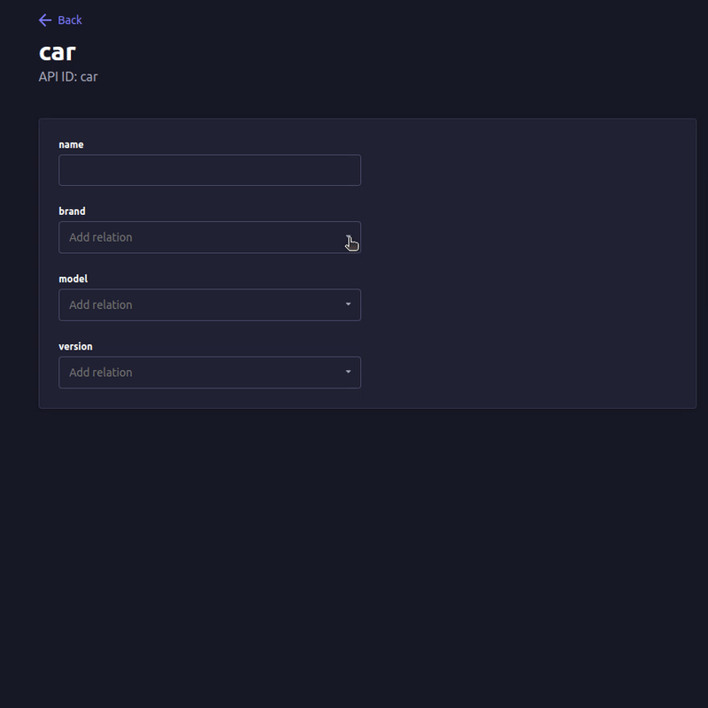 <br/>

<br/>

### Parent-Child Relationships Behavior

The **Parent-Child Relationships** plugin extends the default relationship capabilities in Strapi by providing a way to establish and manage hierarchical relationships between content types.

For instance, in this example, when a brand is selected, only the models associated with that brand are displayed. Furthermore, once a model is chosen, only the versions related to that specific model can be selected, ensuring a clear and logical hierarchy throughout the content management process.

<br>

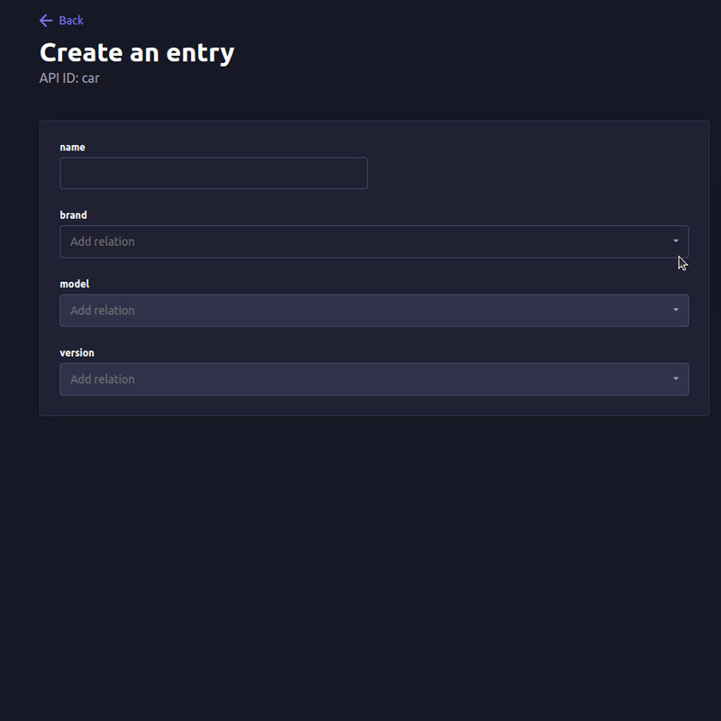 <br/>

<br/>

## ⏳ Installation

To install the plugin, run the following command in your Strapi project directory:

With `npm`:

```bash
npm install strapi-plugin-parent-child-relationships
```

With `yarn`:

```bash
yarn add strapi-plugin-parent-child-relationships
```

## 🖐 Usage

After installation you will find two custom fields at the custom fields section of the content-type builder with the following names:

- **Parent-Child Relation**
- **Dynamic Relation Root**

<br>

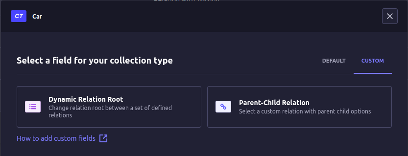 <br/>

<br/>

## 🔧 Configuration - Setting Up a Parent-Child Relationship in Strapi

To configure a parent-child relationship using the **Parent-Child Relationships** plugin, let's walk through an example where we create a `Car` collection type with the following relational fields:

- **brand** (Relationship with the `Brand` collection) - e.g., Audi, BMW
- **model** (Relationship with the `Model` collection) - e.g., A1, A3, X5, X6

### Scenario Overview

When a specific brand is selected—let's say Audi—our objective is to dynamically filter and display only the associated models for that brand (e.g., A1, A3) while excluding unrelated models. This setup ensures a highly contextualized and organized relationship between content types in Strapi, improving content management efficiency.

### Achieving Contextual Filtering Using the Parent-Child Schema

To accomplish this, we need to establish a parent-child hierarchy where selecting a brand will automatically filter the available model options. This requires a setup where the model results are dynamically filtered based on the parent brand's unique identifier. For our example, we utilize the `code` field in the `Brand` collection and `brand_code` in the `Model` collection to create the relationship.

### Collections Schema

#### Brands

| name | code |
| ---- | ---- |
| Audi | AUD  |
| BMW  | BMW  |

#### Models

| name | brand_code | model_code |
| ---- | ---------- | ---------- |
| A1   | AUD        | AUD_A1     |
| A3   | AUD        | AUD_A3     |
| X5   | BMW        | BMW_X5     |
| X6   | BMW        | BMW_X6     |

As you can see, each brand has a `code` that serves as the identifier for grouping associated models. The `brand_code` in the `Model` collection is used to filter which models are shown based on the selected brand. In this setup, models belonging to Audi have a `brand_code` of `"AUD"`, and models belonging to BMW use `"BMW"`.

### Leveraging the Parent-Child Relation Custom Field in Strapi

The **Parent-Child Relation** custom field is instrumental in configuring which fields will establish the hierarchical relationship. In our scenario, the fields involved are:

- `code` in the `Brand` collection
- `brand_code` in the `Model` collection

While these fields do not share the exact same name, the values must match to create the desired parent-child filtering effect.

In our example, selecting the Audi brand with `code: "AUD"` will cause the custom field to filter and display only models that also have a `brand_code` of `"AUD"`.

### Step-by-Step Configuration in Strapi

#### Step 1: Create the Car Collection

Create the `Car` collection type in Strapi, including the necessary relational fields (`brand` and `model`) that will require filtering.

<br>
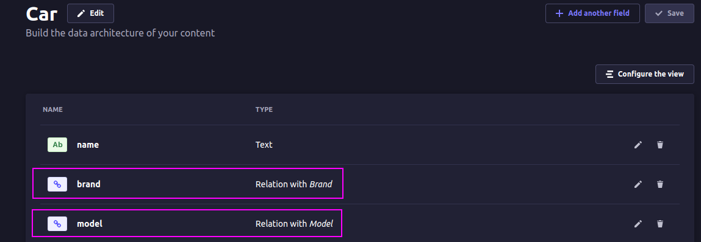 <br/>

#### Step 2: Add Parent-Child Relation Custom Fields

Next, add a **Parent-Child Relation** custom field for each of the relational fields involved in the filtering operation.

- **Brand Field**: Set the **Relation name** as `brand`.

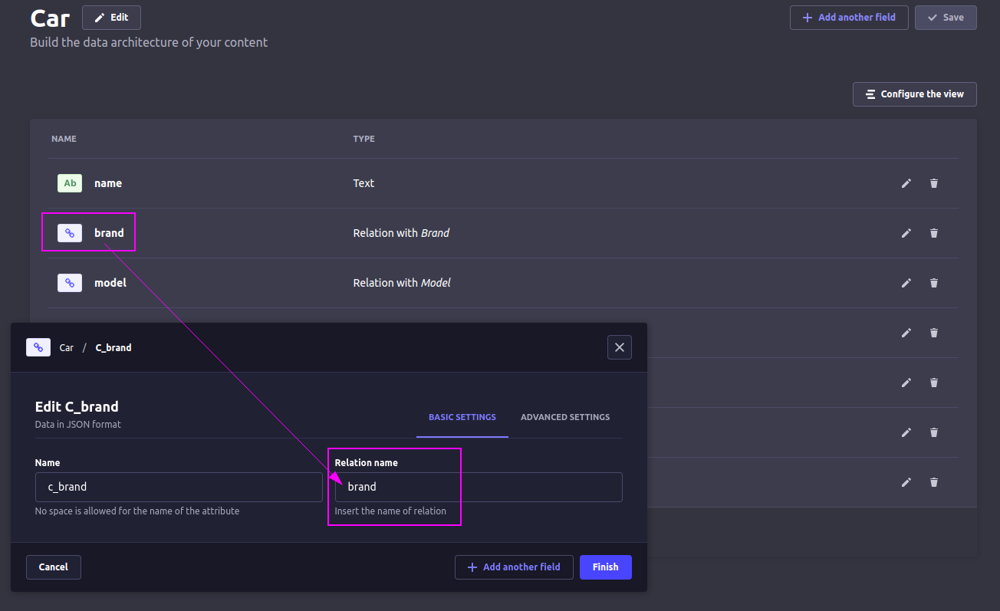 <br/>
<br>

- **Model Field**: Set the **Relation name** as `model`.

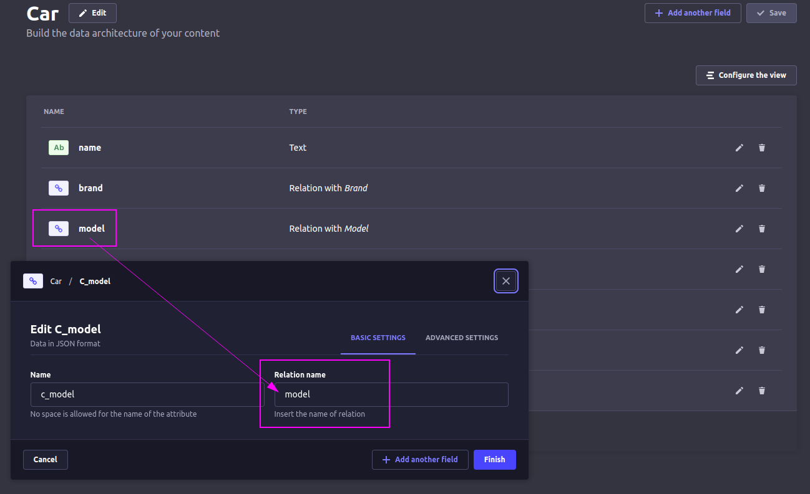 <br/>
<br>

#### Final Overview of Car Collection Type Fields

Here is a visual overview of the fields configured for the `Car` collection type:

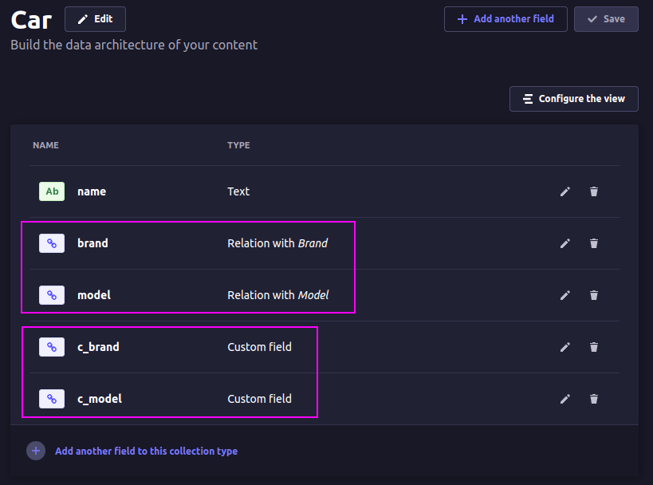 <br/>
<br>

### Advanced Configuration of Filtering Logic

- **Brand Field Configuration**: The `c_brand` field will be configured without a parent. The filtering configuration ensures that the models displayed have a matching `brand_code` to the selected brand's `code`.

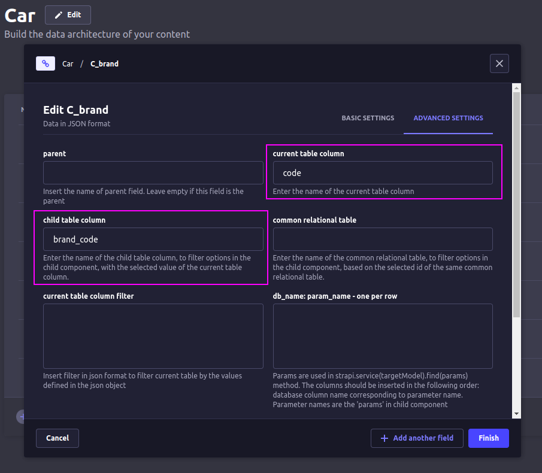 <br/>
<br>

- **Model Field Configuration**: For the model field (`c_model`), specify that its parent is `c_brand`.

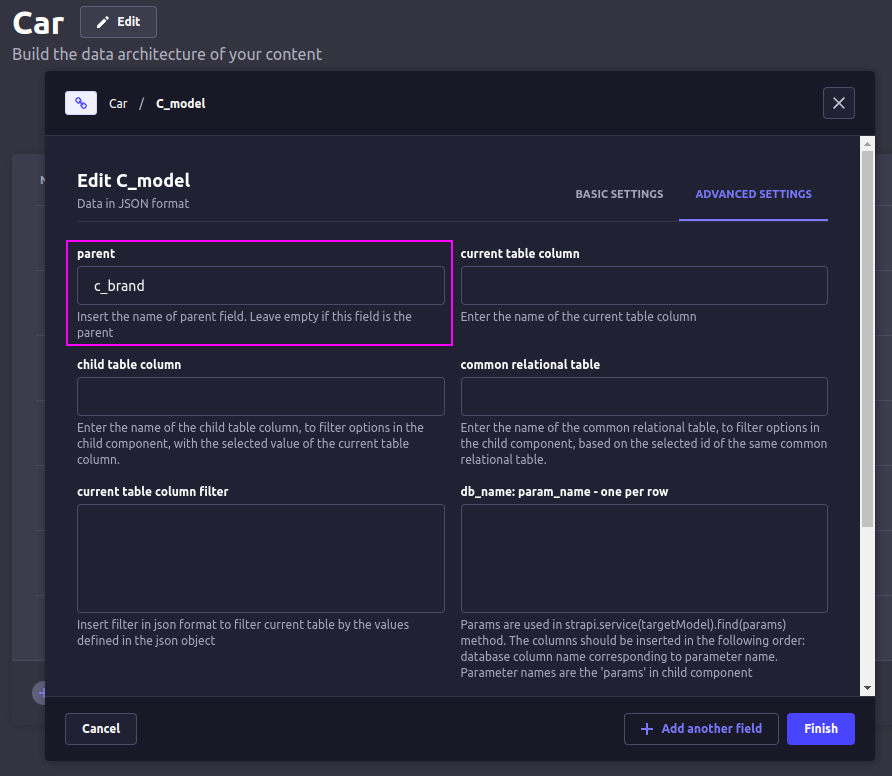 <br/>

This configuration establishes that the `c_model` field depends on the `c_brand` field for filtering, effectively creating a parent-child relationship.

### Conclusion

You have now successfully set up a hierarchical relationship between `brand` and `model` in your `Car` collection type by specifying parent-child filtering rules.

### Content Manager

Now, in the Content Manager, you will see both the default Strapi fields and the custom fields. This is normal.

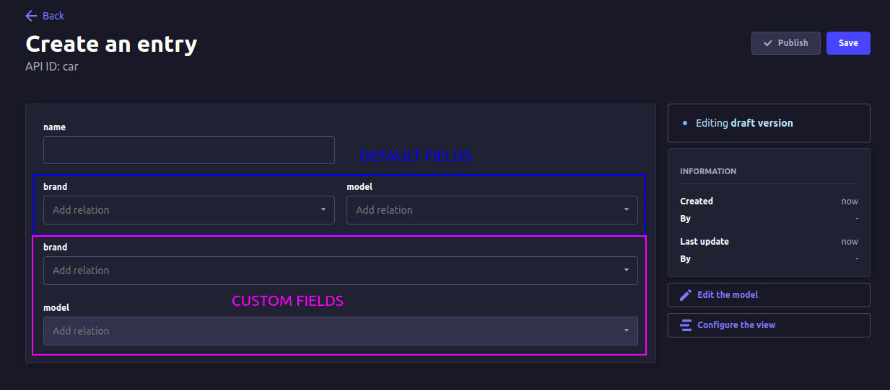 <br/>
<br/>

To resolve this and display only the custom fields, you need to hide the default fields by using **Configure The View**.

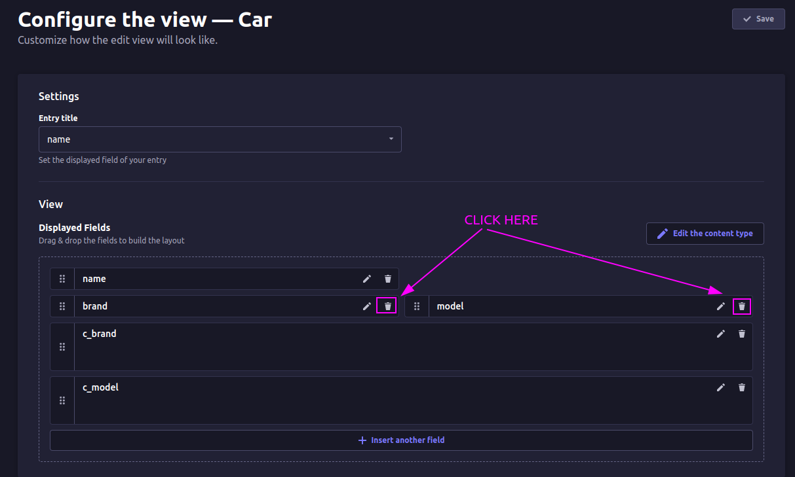 <br/>
<br/>

### Result

Now you can start creating your entries.

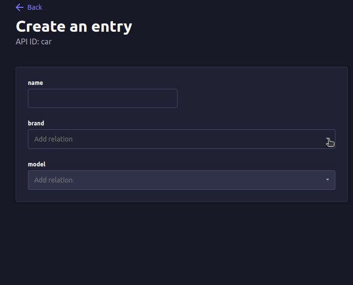 <br/>
<br/>

## Next Step

Now that we have learned how to create parent-child relationships, we can extend this concept further.

Suppose we want to filter between versions once a model is selected. This means we need to establish a parent-child relationship between the selected model and its versions.

### Collections Schema

#### Brands

| name | code |
| ---- | ---- |
| Audi | AUD  |
| BMW  | BMW  |

#### Models

| name | brand_code | model_code |
| ---- | ---------- | ---------- |
| A1   | AUD        | AUD_A1     |
| A3   | AUD        | AUD_A3     |
| X5   | BMW        | BMW_X5     |
| X6   | BMW        | BMW_X6     |

#### Versions

| name               | version_code |
| ------------------ | ------------ |
| Sport line edition | AUD_A1       |
| Business edition   | AUD_A1       |
| S line             | AUD_A3       |
| xDrive sport       | BMW_X5       |
| xDrive city        | BMW_X5       |
| xDrive competition | BMW_X6       |
| xDrive sport       | BMW_X6       |
| xDrive 4X4         | BMW_X6       |

As you can see, each model has a `model_code` that serves as the identifier for grouping associated versions. The `version_code` in the `Version` collection is used to filter which versions are shown based on the selected model. In this setup, versions belonging to `A1` have a `version_code` of `"AUD_A1"`, and versions belonging to `X5` use `"BMW_X5"`.

### Content Type Builder Configuration

Let's start by adding the relational field for **version** and creating the custom field associated with the newly added relational field.

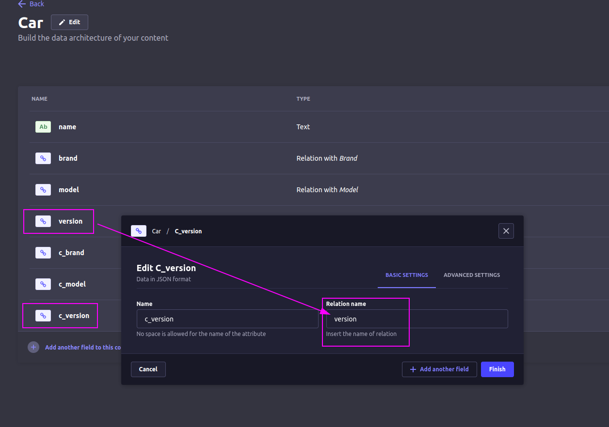 <br/>
<br/>

Next, we will configure the custom field for **version** and specify that its parent is the custom field **c_model**.

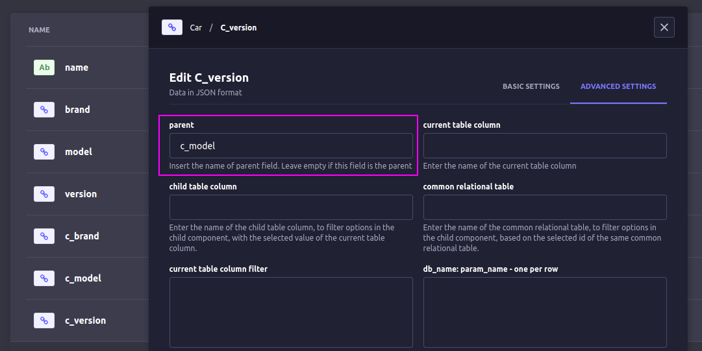 <br/>
<br/>

Finally, we need to configure the **c_model** field, defining the fields involved in filtering the versions based on the selected model.

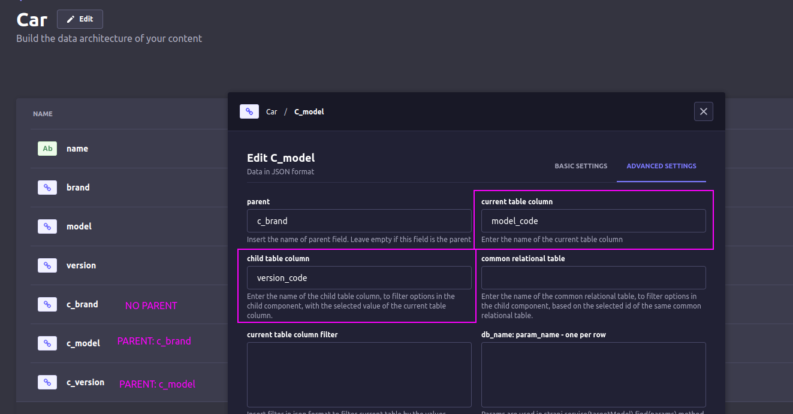 <br/>
<br/>

### Content Manager Car View

In the Content Manager, you will now see three default Strapi relational fields:

- **brand**
- **model**
- **version**

And three custom fields:

- **c_brand**
- **c_model**
- **c_version**

In the video below, you can see the difference between using the original fields (the first three in a row, right below the name), which display all possible results without any filtering, and the custom fields displayed in separate rows.

Notice how the default fields show no filtering, while the custom fields provide contextual filtering based on your selections. You cannot select a model without first choosing a brand, and similarly, you cannot select a version without first selecting a model.

In **Configure The View**, you can hide the default fields and display only the custom fields to streamline the interface.

This entire process is demonstrated in the video.

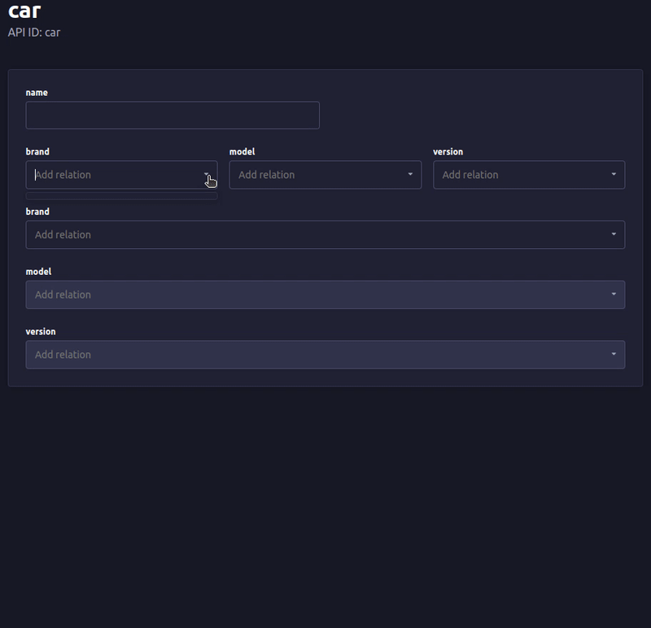 <br/>
<br/>

## Advanced Field Options: Explanation of Other Fields

- **common relational table**
- **current table column filter**
- **db_name: param_name - one per row**
- **static_value: param_name - one per row**

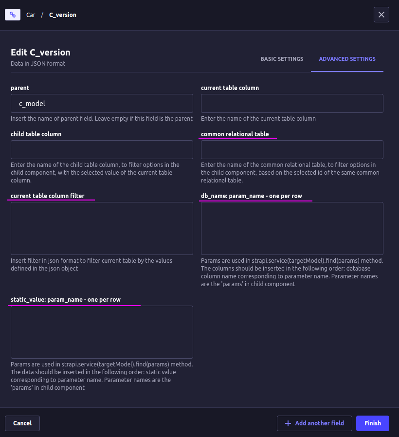 <br/>
<br/>

### `current table column filter`

The `current table column filter` field allows you to add an extra layer of filtering to the results returned by a relation. Let’s look at an example.

Suppose we have an additional field called **segment** in our `Versions` collection:

#### Versions

| name               | version_code | segment |
| ------------------ | ------------ | ------- |
| Sport line edition | AUD_A1       | sport   |
| Business edition   | AUD_A1       | city    |
| S line             | AUD_A3       | sport   |
| xDrive sport       | BMW_X5       | sport   |
| xDrive city        | BMW_X5       | city    |
| xDrive competition | BMW_X6       | sport   |
| xDrive sport       | BMW_X6       | sport   |
| xDrive 4X4         | BMW_X6       | suv     |

With the `current table column filter`, you can apply a JSON filter to limit the results further.

For instance, if we only want to display sports versions of cars, we can apply the following filter:

```
{"segment": "sport"}
```

By adding this filter, only the sports versions will be displayed in the results.

For example, if we select the brand **BMW** and the model **X5**, without the filter we would see:

- xDrive sport
- xDrive city

With the filter applied, we will only see:

- xDrive sport

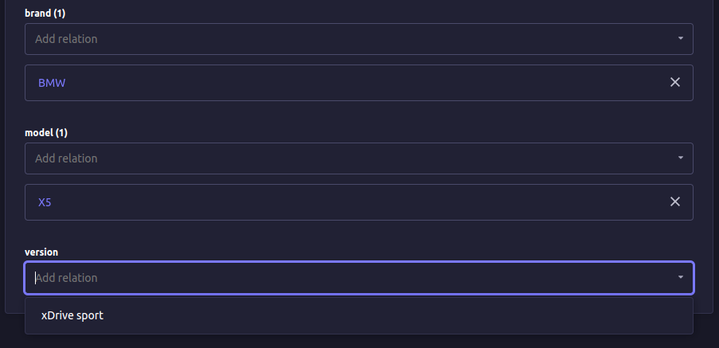

It's possible to create more complex filters.

For example, let's say we want to introduce an additional condition, where we only want versions whose names contain **xdrive** (case-insensitive).

We can modify the previously applied filter like this:

```
{"segment": "sport", "name": {"$containsi": "xdrive"}}
```

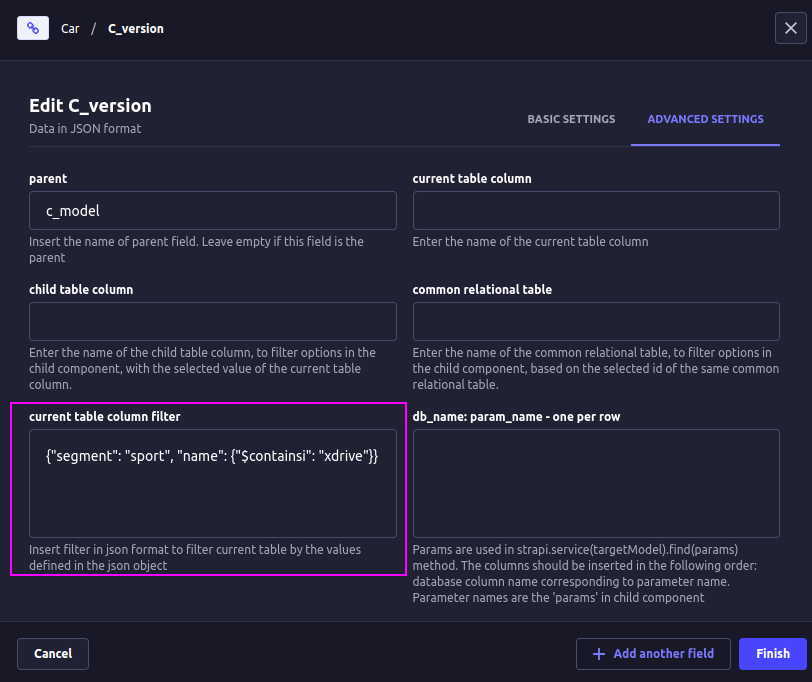

Now, the results will only return versions where the `segment` is equal to "sport" and the `name` contains the word "xdrive" (case-insensitive).
